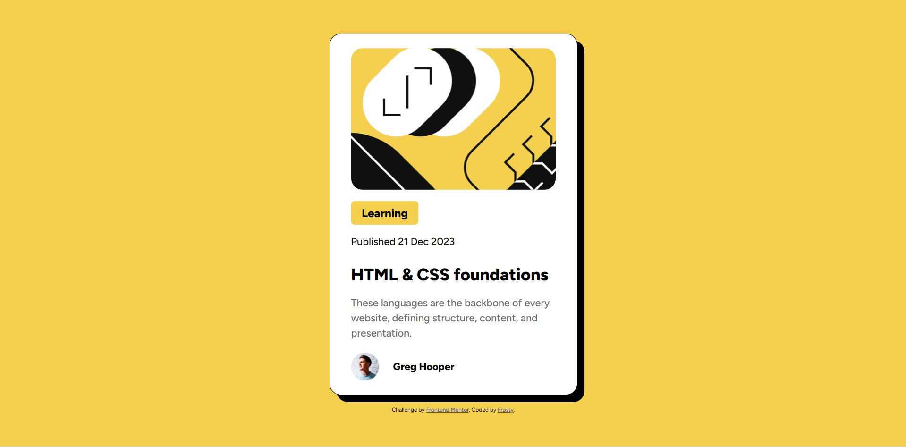

# Frontend Mentor - Blog preview card solution

This is a solution to the [Blog preview card challenge on Frontend Mentor](https://www.frontendmentor.io/challenges/blog-preview-card-ckPaj01IcS). Frontend Mentor challenges help you improve your coding skills by building realistic projects. 

## Table of contents

- [Overview](#overview)
  - [The challenge](#the-challenge)
  - [Screenshot](#screenshot)
  - [Links](#links)
- [My process](#my-process)
  - [Built with](#built-with)
- [Author](#author)

**Note: Delete this note and update the table of contents based on what sections you keep.**

## Overview

Another simple HTML and CSS exercise for Frontend Mentor. In this one,
we use a :hover pseudo-class to have the header change color on hover.

### The challenge

Users should be able to:

- See hover and focus states for all interactive elements on the page

### Screenshot

### Links

- Solution URL: [Github link](https://github.com/frosty-flake/frontend-mentor/tree/main/blog-preview-card-main)
- Live Site URL: [Live site link](https://frosty-flake.github.io/frontend-mentor/blog-preview-card-main/)

## My process

I built this by structuring the HTML first, then building the CSS from
outside in.

Noticing that the yellow color was used many times, I used a CSS custom
property to give it a name.

I use Flexbox to make the card more adaptable to smaller device widths.

I placed the image as a background for a div instead, so that it will
automatically shrink when the card is narrower.

### Built with

- Semantic HTML5 markup
- CSS custom properties
- Flexbox

## Author

- Frontend Mentor - [@frosty-flake](https://www.frontendmentor.io/profile/frosty-flake)

