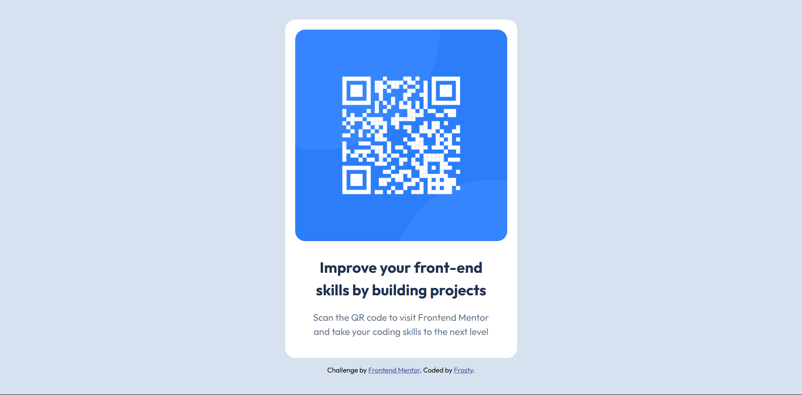

# Frontend Mentor - QR code component solution

This is a solution to the [QR code component challenge on Frontend Mentor](https://www.frontendmentor.io/challenges/qr-code-component-iux_sIO_H). Frontend Mentor challenges help you improve your coding skills by building realistic projects. 

## Table of contents

- [Overview](#overview)
  - [Screenshot](#screenshot)
  - [Links](#links)
- [My process](#my-process)
  - [Built with](#built-with)
  - [What I learned](#what-i-learned)
- [Author](#author)

**Note: Delete this note and update the table of contents based on what sections you keep.**

## Overview

This is a simple HTML and CSS challenge to create a static QR code
component. The QR code has to fit both mobile and desktop screen sizes.

### Screenshot

### Links

- Solution URL: [https://github.com/frosty-flake/frontend-mentor/tree/main/qr-code](https://github.com/frosty-flake/frontend-mentor/tree/main/qr-code)
- Live Site URL: [https://frosty-flake.github.io/frontend-mentor/qr-code](https://frosty-flake.github.io/frontend-mentor/qr-code)

## My process

I started by building out the HTML, creating a container div to contain 
the image and text. Then, I decorated it with CSS, starting from the 
outermost components.

To make the design responsive, I used Flexbox, and I set the container 
width to be at most 95% of the view width.

### Built with

- Semantic HTML5 markup
- CSS
- Flexbox

### What I learned

One thing I learnt is that a flex container needs to have a set width to
use justify-content properly.

Other than that, I learnt a little bit of responsive design, and I was 
able to practice some basic HTML and CSS.

## Author

- Frontend Mentor - [@frosty-flake](https://www.frontendmentor.io/profile/frosty-flake)

