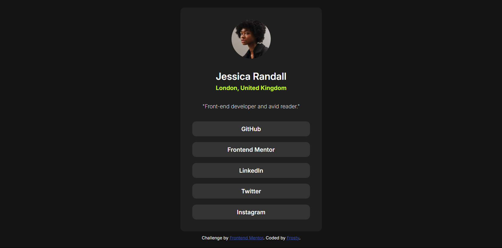

# Frontend Mentor - Social links profile solution

This is a solution to the [Social links profile challenge on Frontend Mentor](https://www.frontendmentor.io/challenges/social-links-profile-UG32l9m6dQ). Frontend Mentor challenges help you improve your coding skills by building realistic projects. 

## Table of contents

- [Overview](#overview)
  - [The challenge](#the-challenge)
  - [Screenshot](#screenshot)
  - [Links](#links)
- [My process](#my-process)
  - [Built with](#built-with)
  - [What I learned](#what-i-learned)
- [Author](#author)

## Overview

### The challenge

Users should be able to:

- See hover and focus states for all interactive elements on the page

### Screenshot

### Links

- Solution URL: [https://github.com/frosty-flake/frontend-mentor/tree/main/social-links-profile-main](https://github.com/frosty-flake/frontend-mentor/tree/main/social-links-profile-main)
- Live Site URL: [https://frosty-flake.github.io/frontend-mentor/social-links-profile-main/](https://frosty-flake.github.io/frontend-mentor/social-links-profile-main/)

## My process

I started by building the HTML skeleton for the page, then added style from the outside in.

### Built with

- Semantic HTML5 markup
- CSS custom properties
- Flexbox

### What I learned

Nothing much, this exercise was quite simple. However, it did let me refresh my memory on CSS.

## Author

- Frontend Mentor - [@frosty-flake](https://www.frontendmentor.io/profile/frosty-flake)
